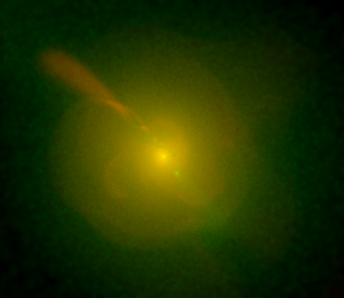

  

    
  

  

    

   I'm a theoretical astrophysicist and mathematician at the University of Utah. My research is shared between the Department of Physics
and Astronomy, where I study galaxy cluster dynamics and gravitational theory; and the School of Dentistry, where I work on mathematical models
of trade-mediated pathogens in complex global trade networks. 
  

  

 
 
 
 
 
 

Research Interests
==================

As a researcher, I am deeply comitted to the philosophy of interdisciplinary and holistic exploration of science in all its
forms. I am, first and foremost, a theoretical astrophysicist, but I make time to explore areas of interest in other disciplines, particularly
epidemiology and applied mathematics. I am fascinated by the methodological, cultural, and philosophical cross-over between
these various fields of scientific inquiry and the different ways in which each informs my thinking on research questions in the others.

In the menus below, you can find some details on my research interests and current projects in each of these areas.

<button class="accordion">Physics and Astronomy</button>

  
Lorem ipsum...

<button class="accordion">Epidemiology</button>

  
Lorem ipsum...

<button class="accordion">Applied Mathematics</button>

  
Lorem ipsum...

    <table >
     <tr>
        <td><b>Physics Research</b></td>
        <td><b>Epidemiology Research</b></td>
     </tr>
     <tr>
<td>
My research in astrophysics is focused on using galaxy clusters and their properties to constrain other problems in
astrophysics, cosmology, and other areas of research. Galaxy clusters can be used as probes of modified gravity theories, of structure formation
in the early universe, of stellar evolution history; however, our understanding of the underlying behavior of galaxy clusters remains remedial. Issues like turbulence, magnetic fields, and geometry are all 
very current areas of research in galaxy clusters and have major implications for our ability to use these systems for other scientific objectives. 
 
<b>Active Research Areas:</b> 
<ul>
<li>Modified gravity theories as an alternative to dark matter
<ul>
<li>
Modified gravity theories are very successful in some regimes, but highly flawed in others. Do they have anything to give?
</li>
<li>
If modified gravity theories are wrong (which is very likely), what <i>can</i> they tell us about the flaws in our current understanding of cosmology and gravity?
</li>
</ul>
</li>
<li>
Galaxy cluster dynamics
<ul>
<li>
How do systemic biases made in observation (spherical symmetry, hydrostatic equilibrium, etc) impact the observational results.
</li>
<li>
How do magnetic fields in galaxy clusters form, what is their behavior, and how do they impact the behavior of the cluster.
</li>
<li>
In cluster mergers, how relaxed are the resultant systems? Do we overlook gross deviation from hydrostatic equilibrium in systems which do
not look obviously perterbed?
</li>
</ul>
</li>
</ul>
</td>
<td>
My interests in epidemiology are focused on trade-mediated pathogens, which are spread from person to person through the 
supply chain of various foods. Because this modality of transmission is considered rare, it is drastically overlooked given the ever
expanding nature of the underlying networks. My research uses novel algorithms to generate trade networks on which to simulate 
outbreaks of trade mediated pathogens and study their behaviors.
 
 
<b>Active Research Areas:</b> 
<ul>
<li> Public Health Impacts
<ul>
<li>
How likely is trade mediated pathogen emergence? What kinds of pathogens are of concern?
</li>
<li>
What populations are most at risk? What can we do to improve trade policy to protect people and states which are more susceptible
to these pathogens?
</li>
<li>
Can we develop early warning systems to determine the underlying source of a trade mediated pathogen?
</li>
</ul>
</li>

</ul>
</td>
     </tr>
    </table>
    

